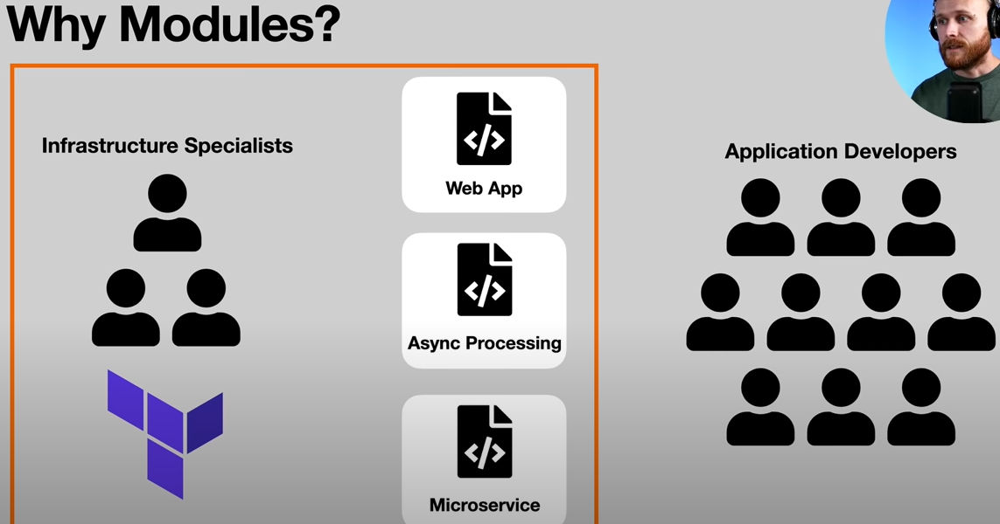
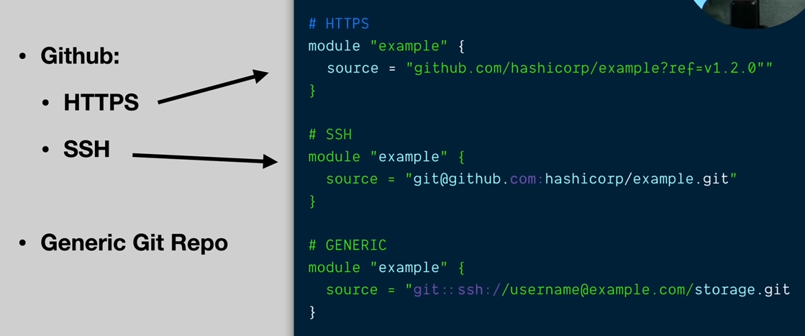
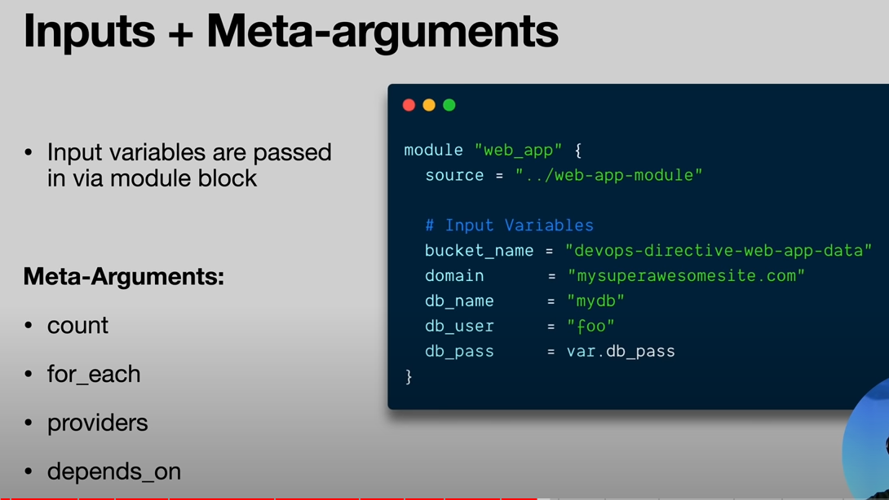
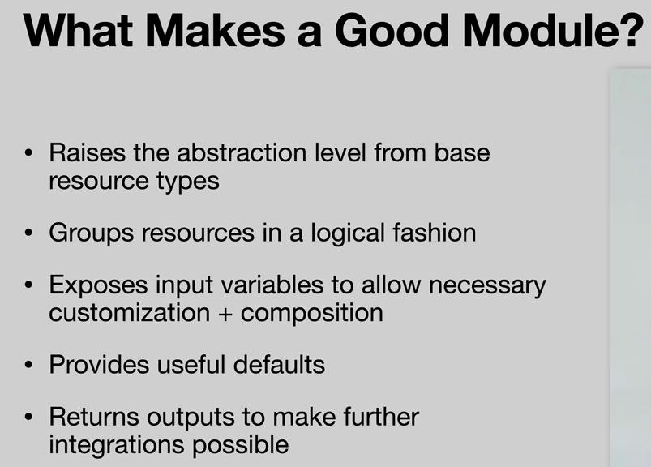

## Modifications
- remove backend definition
- remove provider definition

## What is a Module
- Modules are containers for multiple resources that are user together. A module consists of a collection 
of .tf and/or .tf.json files kept together in a directory
- Modules are the main way to package and reuse resource configurations with Terraform

## Why use a module

## Module Types

- Root module. Default containing all .tf files in the main working directory
- Child module. A separate external modules referred to from a .tf file

## Module sources
- Local paths
- Terraform Registry
- Github
- Bitbucket
- Generic Git, Mercurisl repo
- HTTP URLs
- S3/GCS Buckets

## How to import modules

## Inputs with Meta-arguments

## What makes a good module

