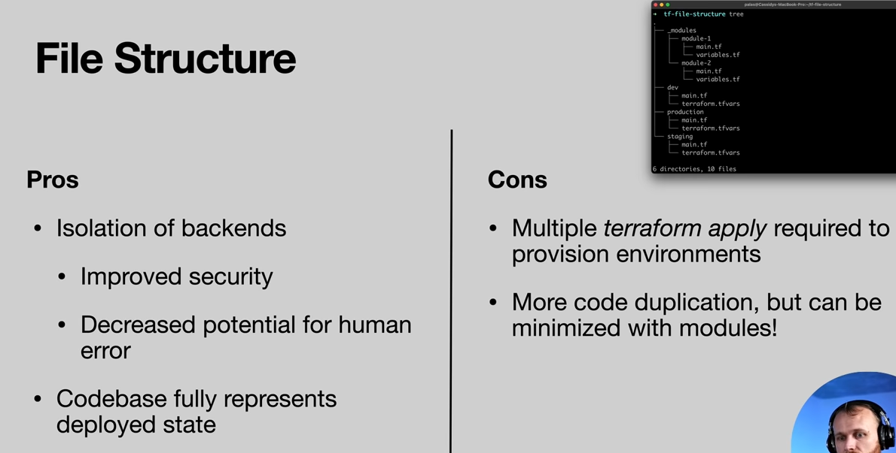
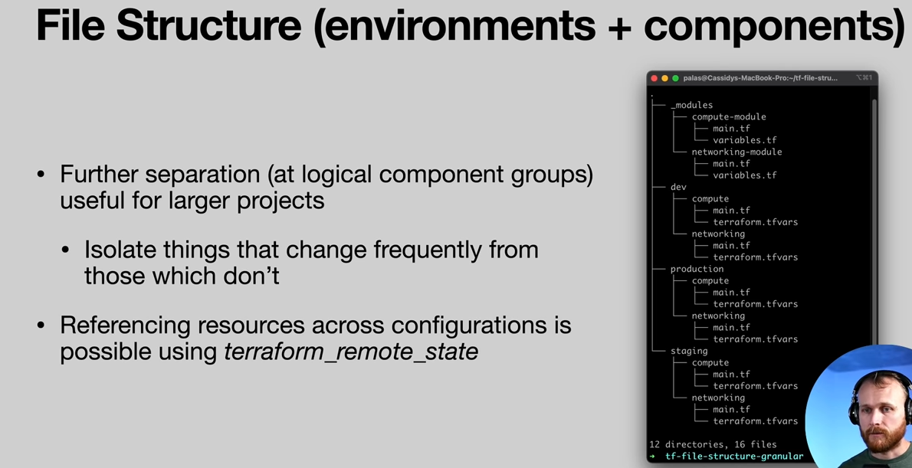

- Note about using separate AWS accounts (avoids prefix issues, improved IAM control)
  - Cover this in advanced section?
  
```
provider “aws” {
  region = “us-east-1”
  assume_role {
    role_arn = “arn:aws:iam::123456789012:role/iac”
  }
}
```

## File structure






## Set-up
1. Deploy global first, like so: `terraform init`, `terraform apply`
2. 