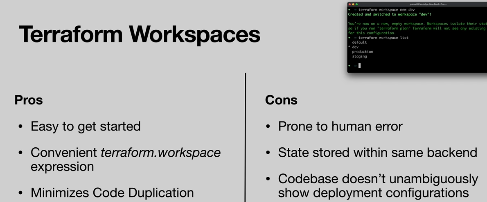

Warning about manually switching environments
```
terraform workspace new production
terraform workspace list
terraform workspace select staging
```

## Terraform Workspaces 



## Terraform Workspaces Environment

- Run `terraform workspace list` on terminal to know what environment you already have, like so:
    ```
    (venv) abelo@Abes-MacBook-Pro workspaces % terraform workspace list
    * default
    ```

- Run `terraform workspace new production` you will see
    ```
    Created and switched to workspace "production"!
    
    You're now on a new, empty workspace. Workspaces isolate their state,
    so if you run "terraform plan" Terraform will not see any existing state
    for this configuration.
    
    ```

- Run `terraform workspace list`, you can select which environment you want to use like so

- To switch environment run `terraform workspace <name>` like so: `terraform workspace production`